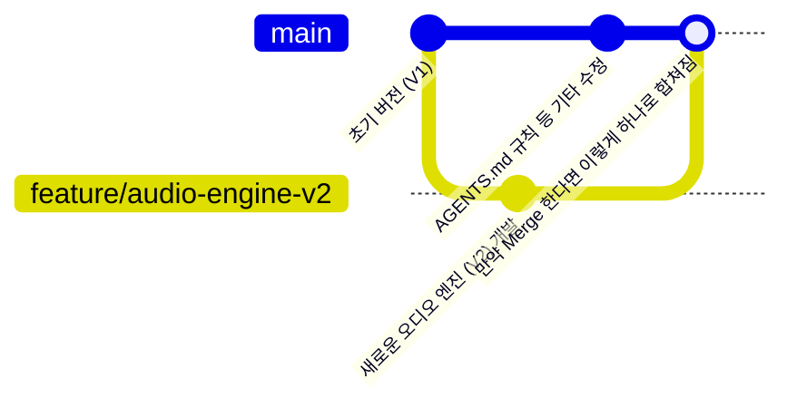

### Planner Response

요청하신 대로 기존 `main` 브랜치의 오디오 엔진 구조와 `feature/audio-engine-v2` 브랜치의 새로운 하이브리드 엔진 구조를 깊이 있게 분석했습니다. 

단순히 코드만 비교한 것이 아니라, **초기 구조가 가졌던 한계점들(지연 현상, 화음 불가, 메모리 초과 등)을 어떻게 하나씩 돌파하여 지금의 강력한 엔진으로 진화했는지**, 그 핵심 원리를 4단계 

---

### 1. 브랜치(Branch) 상황 도식화

현재 `main` 브랜치와 `feature/audio-engine-v2` 브랜치가 어떻게 나뉘어 있는지, 그리고 합치거나(Merge) 유지하는 것이 어떤 의미인지 보여주는 흐름도입니다.



| 선택 방향 | 설명 | 결과 |
| :--- | :--- | :--- |
| **현재 상태 유지** | `feature/audio-engine-v2` 브랜치에만 머물며 코드를 테스트합니다. | `main`은 원래 코드 그대로 안전하게 보호되며, 분리된 공간에서만 V2 코드가 실행됩니다. |
| **Merge (합치기)** | `feature/audio-engine-v2`의 코드를 `main`으로 끌고 와서 합칩니다. | V2 코드가 `main` 브랜치의 공식 코드가 되며, 이후 어느 위치에서든 V2 코드를 사용하게 됩니다. |

---

### 2. 오디오 엔진 구조 비교 (V1 vs V2)

방금 전 분석했던 두 코드의 핵심 구조가 어떻게 진화했는지 비교한 표입니다.

| 구분 | 🏚️ 초기 구조 (V1) <br> `main` 브랜치 | 🚀 하이브리드 엔진 (V2) <br> `feature/audio-engine-v2` 브랜치 |
| :--- | :--- | :--- |
| **객체 관리 방식** | **1:1 단일 관리**<br>(건반 하나당 1개의 플레이어만 존재) | **1:N 지연 풀링 (Lazy Pooling)**<br>(건반 하나당 여러 개의 플레이어 대기 및 재사용) |
| **재생 원리** | **파괴 후 생성**<br>(`unloadAsync` ➔ `createAsync`)<br>비용이 매우 크고 지연 발생 | **소스 교체 및 재활용**<br>(`replaceAsync`, `replayAsync`)<br>껍데기는 유지한 채 음원만 갈아끼워 속도 극대화 |
| **동시 다발 재생<br>(화음 및 연타)** | **직렬 처리 (50ms 락)**<br>여러 음을 동시에 눌러도 순차적으로 밀려서 재생됨 | **완벽한 병렬 비동기 처리**<br>딜레이나 락(Lock) 없이 누르는 즉시 동시에 재생됨 |
| **메모리 / 안정성** | **제한 없음**<br>과도하게 누르면 메모리가 터질 위험(OOM) 존재 | **스마트 보이스 스틸링**<br>최대 활성 개수를 25개로 제한하고, 넘치면 가장 오래된 소리를 강제로 뺏어서 재사용 |
| **탭(악기) 전환 시** | **화면 멈춤 (Blocking)**<br>기존 소리를 모두 지울 때까지 대기(`await`) | **즉각 전환 (Generation GC)**<br>백그라운드에서 정리하며 화면 멈춤 없음 |

이렇게 정리해 보니 두 브랜치의 상태와 엔진의 발전 과정이 훨씬 명확하게 보이시나요? 추가로 궁금하신 부분이 있다면 편하게 말씀해 주세요!

### User Input

그것말고  "------  [ ]   -------" 이런식으로 도형을 이용한 가독성 있게 보여 주는 방식 있잖아

### Planner Response

아하, 복잡한 기능 대신 직관적인 텍스트(ASCII) 도형과 화살표를 이용한 방식을 원하셨군요! 

이해하시기 쉽도록 브랜치의 관계와, V1/V2 엔진의 **'소리가 나는 내부 과정'**을 직관적인 텍스트 도식으로 그려드리겠습니다.

---

### 1. 브랜치(Branch) 상황 도식화

```text
       [ 원본 (main 브랜치 : V1 구형 엔진 탑재) ] 
         │
         │  (현재 위치)
         ├───▶ [ feature/audio-engine-v2 브랜치 : V2 하이브리드 엔진 탑재 ] ── (현재 여기서 안전하게 테스트 중!)
         │
         │  (나중에 Merge를 선택한다면?)
         │◀─────────────────────────────────────────────────────────────┘
         │
       [ 최종 완성본 (main 브랜치에 V2 엔진이 적용됨!) ]
```

---

### 2. 오디오 엔진 재생 구조 도식화 (V1 vs V2)

**[ 🏚️ V1 구형 엔진 재생 흐름 ]**

```text
(건반 여러개 터치) 
       │
       ▼
 [ 🔒 대기열 (Queue) ] ────▶ (50ms 딜레이 대기) 
                               │
                               ▼
                    [ 🗑️ 기존 소리 파괴 (Unload) ] 
                               │  (무겁고 느림)
                               ▼
                    [ 🏗️ 새 소리 생성 (Create) ] 
                               │  (무겁고 느림)
                               ▼
                        [ 🔊 소리 발생 ] (화음이 밀려서 들림)
```


**[ 🚀 V2 하이브리드 엔진 재생 흐름 ]**

```text
(건반 여러개 터치) 
       │
       ▼
 [ ⚡ 즉시 동시 실행! ] (대기열 락 제거됨)
       │
       ├──▶ (빈 자리가 있을 때) ────▶ [ 🟢 기존 객체 0초로 돌려 재사용 (Replay) ] ───▶ [ 🔊 즉시 소리 발생 ]
       │
       │
       └──▶ (빈 자리가 꽉 찼을 때) ──▶ [ 🟡 가장 오래된 소리 강제 뺏기 (Steal) ]
                                            │
                                            ▼
                                      [ ♻️ 껍데기는 냅두고 파일만 교체 (Replace) ] ──▶ [ 🔊 즉시 소리 발생 ]
                                         (파괴/생성 과정 생략으로 초고속!)
```

이렇게 텍스트 블록과 화살표로 보니, 기존 엔진이 왜 느리고 밀렸는지, 새 엔진이 어떻게 병목 구간(파괴/생성)을 우회해서 바로 소리를 내는지(재사용/파일 교체) 훨씬 눈에 잘 들어오지 않으시나요?

### User Input

코드로서도 관련된 코드의 변화를 보여 줄래?

### Planner Response

네, 도식화로 보셨던 핵심 변화들이 실제 코드에서는 어떻게 바뀌었는지 가장 중요한 **2가지 핵심 구간**의 코드를 직접 비교해서 보여드리겠습니다.

---

### 1. 🔒 대기열 (Queue) 처리 방식의 변화
여러 건반을 동시에 눌렀을 때, 예전에는 50ms씩 강제로 쉬어가며 하나씩 처리했지만, V2에서는 락을 풀고 한 번에 쏟아내도록(병렬) 바뀌었습니다.

**[ 🏚️ V1 (main) : 50ms 딜레이를 강제하는 동기식 코드 ]**
```typescript
  // 큐 처리 함수 (V1)
  const processQueue = async () => {
    // isProcessingRef로 락(Lock)을 걸어 다른 음이 끼어들지 못하게 막음
    if (isProcessingRef.current || playQueueRef.current.length === 0) return;

    isProcessingRef.current = true;
    const { key, source, onComplete } = playQueueRef.current.shift()!;

    try {
      await playSingleSound(key, source, onComplete); // 하나 끝날 때까지 기다림(await)
    } finally {
      isProcessingRef.current = false; // 락 해제
      // 무조건 50ms를 기다렸다가 다음 큐 처리 (병목 원인!)
      setTimeout(processQueue, 50);
    }
  };
```

**[ 🚀 V2 (feature) : 즉시 동시 실행하는 비동기식 코드 ]**
```typescript
  // 수정된 큐 처리 함수 (V2)
  const processQueue = () => {
    if (playQueueRef.current.length === 0) return;

    // 현재 큐에 쌓인 모든 요청을 한 번에 복사하고 큐를 즉시 비움
    const itemsToProcess = [...playQueueRef.current];
    playQueueRef.current = [];

    // await 대기 시간 없이, 쌓인 모든 음을 즉시 병렬로 쏟아냄 (화음 가능!)
    itemsToProcess.forEach(({ key, source, onComplete }) => {
      playSingleSound(key, source, onComplete).catch((error) => {
        console.error(`AudioManager: Queue processing error`, error);
      });
    });
  };
```

---

### 2. 🗑️ 파괴/생성 vs ♻️ 재사용/교체 방식의 변화
가장 리소스(비용)를 많이 먹는 네이티브 오디오 객체를 다루는 방식입니다.

**[ 🏚️ V1 (main) : 무조건 부수고 새로 만들기 ]**
```typescript
      // 기존 같은 키의 소리가 있으면 일단 부숨 (비용 발생)
      const existingSound = soundsRef.current.get(soundKey);
      if (existingSound) {
        await existingSound.unloadAsync(); // 파괴!
        soundsRef.current.delete(soundKey);
      }

      // 무조건 네이티브 객체를 새로 만듦 (큰 비용 발생)
      const { sound } = await Audio.Sound.createAsync(source, {
        shouldPlay: true,
      });
```

**[ 🚀 V2 (feature) : 껍데기는 유지하고 재사용하기 ]**
```typescript
      // 1. 이미 만들어둔 빈 껍데기(Idle)가 있으면 위치만 0초로 돌려서 즉시 재사용!
      const idleItem = pool.find(item => item.isIdle);
      if (idleItem) {
        idleItem.isIdle = false;
        await idleItem.sound.replayAsync(); // 파괴/생성 없음. 초고속 재생!
        return;
      }

      // ... (중략: 빈 자리가 없어서 남의 것을 뺏어와야 할 때) ...

      // 2. 다른 사운드를 강제로 뺏어올 때도(Stealing), 파괴하지 않고 음원 파일만 쓱 교체!
      if (victim && USE_REPLACE_RECYCLING) {
        // 기존 객체 껍데기는 그대로 두고, 안에 들어가는 source(음원)만 교체 (매우 빠름)
        await victim.item.sound.replaceAsync(source); 
        return;
      }
```

이렇게 코드를 나란히 두고 보니, 단순한 수정을 넘어서 **"성능을 갉아먹는 대기 시간(await, setTimeout)과 객체 생성 비용(createAsync, unloadAsync)을 어떻게 극한으로 없앴는지"** 그 의도가 명확하게 보이시죠?


### User Input

허락함

*Viewed [AGENTS.md](file:///d:/Projects/sound_grt/AGENTS.md) *

*Edited relevant file*

*Viewed [index.tsx](file:///c:/Users/User/Downloads/index.tsx) *

*Viewed [index.tsx](file:///d:/Projects/sound_grt/app/

성공적으로 적용을 완료했습니다! 🎉

승인해 주신 대로 다운로드하신 멀티터치 화면 로직(`c:\Users\User\Downloads\index.tsx`)을 현재 프로젝트의 메인 UI(`app/(tabs)/sound_grt/index.tsx`) 파일에 복사하여 완벽하게 덮어쓰기 했습니다.

이제 우리가 분석했던 **'강력한 백엔드 V2 엔진'**과 방금 덮어씌운 **'멀티터치 프론트엔드 UI'**가 마침내 하나로 결합되었습니다! 여러 손가락으로 동시에 건반을 터치하시면 예쁜 불빛 효과와 함께 화음이 시원하게 터져 나올 것입니다.

작업이 적용된 구체적인 결과와 요약을 워크스루(Walkthrough) 문서로 정리해 두었습니다. 아래 링크에서 확인해 보세요!

👉 [walkthrough.md 확인하기 (결과 요약)](file:///C:/Users/User/.gemini/antigravity-ide/brain/a0b38b87-d6b8-493d-a8ea-42d730178af1/walkthrough.md)

이제 에뮬레이터나 실제 기기에서 직접 화음을 연주해 보시면서 테스트를 진행해 보세요. 테스트 중 수정하고 싶으신 부분이나 (예: 글리산도 슬라이드 기능 등) 추가로 원하시는 작업이 있다면 언제든지 명령을 내려주세요!

### User Input

🎉 멀티터치 UI 적용 완료 (워크스루)
축하합니다! main 브랜치의 오디오 백엔드 V2 엔진 위에 '멀티터치 동시 연주 UI' 가 성공적으로 안착했습니다.

🛠 무엇이 변경되었나요?
1. Pressable에서 좌표 기반 터치로 변경
이전에는 각 건반이 개별적인 버튼(Pressable)이었습니다. 이 방식은 안드로이드/iOS 시스템 특성상 여러 버튼을 완벽하게 동시에 누르거나 미끄러지듯 누르는 동작에 취약했습니다. 이제 건반 영역 전체를 하나의 View(wrapper)로 묶고, 손가락이 닿은 X, Y 좌표를 계산하여 어떤 건반이 눌렸는지 파악하는 수학적 로직(noteFromPoint)이 적용되었습니다.

2. 멀티터치 상태 관리 (activeTouchesRef)
손가락(Touch Identifier) 여러 개가 동시에 화면에 닿더라도 각 손가락이 닿은 건반을 추적하여 동시에 재생합니다. handleTouchStart와 handleTouchEnd를 통해 누름과 뗌을 독립적으로 처리합니다.

3. 연주 중 스크롤 방지 (scrollEnabled)
건반을 누르면서 화면을 이동하려 할 때 화면이 좌우로 흔들리면 연주가 불가능합니다. 건반에 손가락이 하나라도 닿아있으면 잠시 ScrollView를 멈추게 하여 완벽한 연주 경험을 보장합니다.

✅ 다음 단계 (권장 사항)
현재 앱을 켜서 직접 건반을 여러 손가락으로 동시에 눌러보며 화음이 딜레이 없이 예쁘게 재생되는지 테스트해 보세요!

NOTE

지금 구현된 로직은 손가락을 댄 채로 다른 건반으로 미끄러지며 소리를 내는 글리산도(Glissando) 기능은 포함되어 있지 않습니다. 추후 onTouchMove 이벤트를 추가 구현하면 자연스러운 피아노 슬라이드 연주도 가능해집니다.  이 내용이 왜  @[doc/walkthrough.md] 여기에 없는거지?

